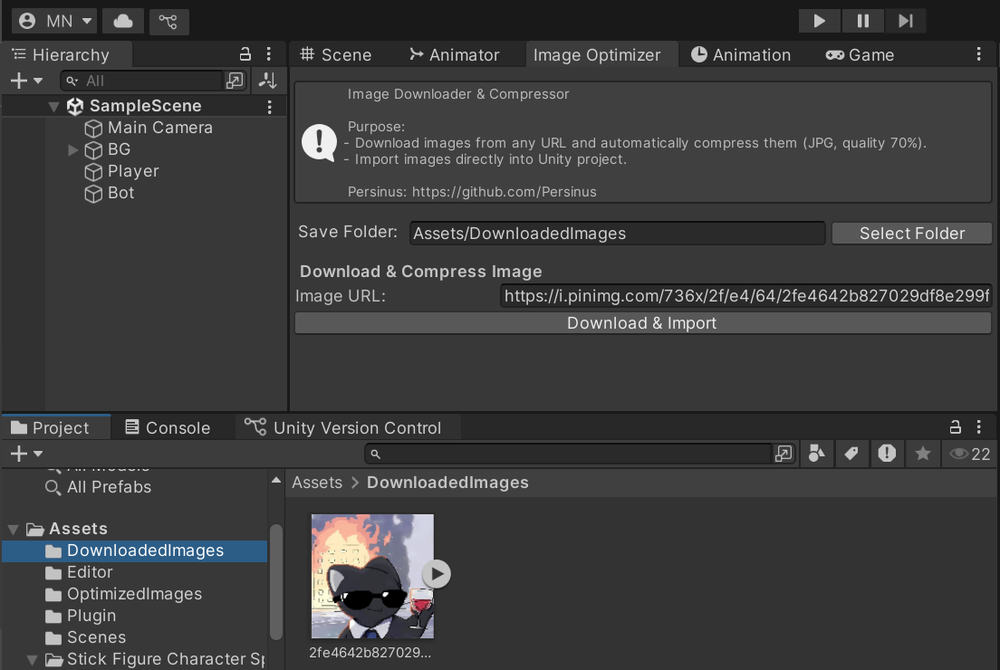

# 🎮 Unity Package - Persinus Image Downloader & Compressor  


  

A **Unity Editor Tool** for downloading images from URLs and automatically compressing them to JPG format.

---

## 🚀 Installation  

### 1. Via Unity Package Manager (UPM)  

1. Open **Unity** → **Window → Package Manager**  
2. Click **+** → **Add package from git URL…**  
3. Paste the following URL:  

```bash
https://github.com/Persinus/Image-Downloader-Compressor
```

---

## ✨ Features  

- Download images from any URL directly inside Unity Editor  
- Automatically compress images to JPG (quality 70%)  
- Display mini-toast notifications for success/failure  
- Show dynamic progress bar during download and compression  
- Saved images imported directly into `Assets/DownloadedImages/`  

---

## 📋 Requirements  

- Unity **2020.3 LTS** or newer  
- .NET Standard 2.1  

---

## 📄 License  

MIT License © 2025 Persinus

